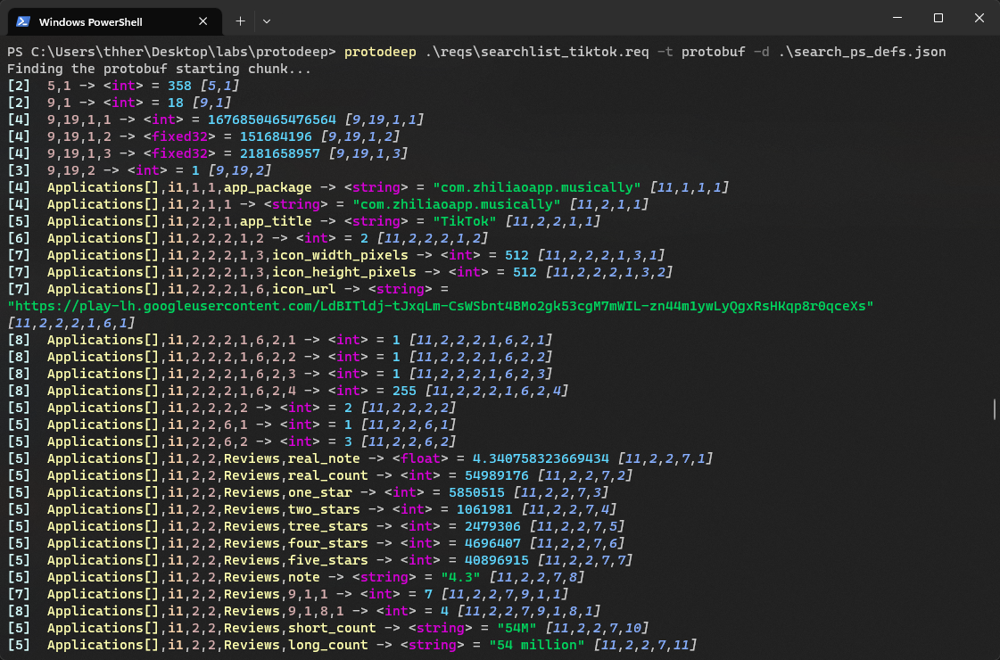
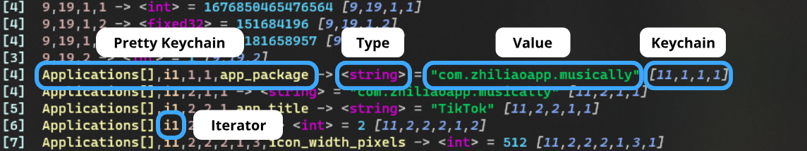
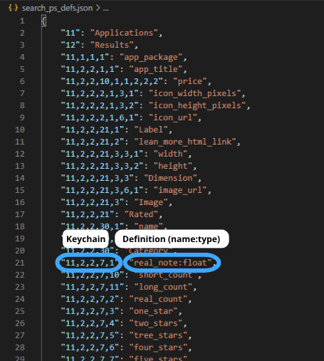

<br>


# 🏄‍♂️ Description

ProtoDeep is an easy to use tool that allows you to decode and analyze protobuf data.

It is **heavily based** on the well-established [Blackbox Protobuf](https://github.com/nccgroup/blackboxprotobuf) package, and inspired by [Protobuf Inspector](https://github.com/mildsunrise/protobuf-inspector) for the custom definitions feature.\
This project was originally intended to be integrated into the [GHunt RDTK](https://github.com/mxrch/ghunt-rdtk), but the script grew a lot and ended up becoming a tool that can help many people.

Features :
- CLI usage
- Python library usage
- Make your own definitions
- Easily match / filter data
- Export and compile on the fly

<br>

Example of using ProtoDeep on the Google's Play Store `searchList` endpoint, with custom definitions :



# ✔️ Requirements
- Python >= 3.10

# ⚙️ Installation

```bash
$ pip3 install pipx
$ pipx ensurepath
$ pipx install protodeep
```
It will automatically use venvs to avoid dependency conflicts with other projects.

# 💃 Usage

## Help menu

```
Usage: main.py [-h] -t TYPE [-d DEFINITIONS] [-na] [-s] [-b] [-bi NUMBER] [-he] [-np] [-m MASK] [-mk MASK] [-mv MASK]
               [-f MASK] [-fk MASK] [-fv MASK] [-epf [PROTOFILE_FILENAME]] [-epd [PROTODEEP_FILENAME]]
               [-c [PYTHON_FILENAME]] [-n SCHEMA_NAME]
               [proto_file]

Positional Arguments:
  proto_file

Options:
  -h, --help            show this help message and exit
  -t, --type TYPE       Either protobuf (raw protobuf content), or protodeep (a ProtoDeep file).
  -d, --definitions DEFINITIONS
                        The file containing the custom protobuf definitions.
  -na, --no-autodetect  Don't try to autodetect if it's a raw HTTP request.
  -s, --stdin           Parse from stdin.
  -b, --base64          If this is a base64 input, so it automatically decodes it.
  -bi, --bruteforce-index NUMBER
                        The index up to which to try bruteforce to find Protobuf content. Default : 20
  -he, --hide-empty     Hide the empty values.
  -np, --no-print       Don't print the decoded protobuf.
  -m, --match MASK      Match anything with the given string. You can use '?' and '*' to wildcard match.Ex : "*token*"
  -mk, --match-keychain MASK
                        Match keychains with the given string.
  -mv, --match-value MASK
                        Match values with the given string.
  -f, --filter MASK     Filter anything with the given string. You can use '?' and '*' to wildcard match.
  -fk, --filter-keychain MASK
                        Filter keychains with the given string.
  -fv, --filter-value MASK
                        Filter values with the given string.
  -epf, --export-protofile [PROTOFILE_FILENAME]
                        Export the proto file with the definitions.
  -epd, --export-protodeep [PROTODEEP_FILENAME]
                        Export a protodeep file, to reuse in ProtoDeep.
  -c, --compile [PYTHON_FILENAME]
                        Compile protobuf into a Python file.
  -n, --name SCHEMA_NAME
                        Name of the schema when exporting into a proto file.
```

## Concepts

Here are the main concepts to know when using ProtoDeep :

### Output example


- Keychains : Since the protobuf is made of nested keys and values, keychains are a way to precisely identify a value in the decoded protobuf. It's the key sequence used to access the value.
- Pretty Keychains : This is the same as keychains, except that the keys are replaced by the names defined in the custom definitions.
- Type : Type of the value. Supported types are listed in this [blackboxprotobuf's file](https://github.com/nccgroup/blackboxprotobuf/blob/master/lib/blackboxprotobuf/lib/types/type_maps.py).
- Value : The value found in the protobuf data.
- Iterator : ProtoDeep will try to autodetect repeated messages, and will print elements of these arrays with the `i<position>` key, so you can know the position of the element in the list.

### Custom definitions file



- Definitions : It is a JSON file, containg a dict with the keychains as keys, and names as values. You can specify the type of a value by adding `:<type>` next to it. By doing so, ProtoDeep will detect it, and relaunch the decoding of the protobuf data with this new type. *Note that it will only work when using protobuf data, not a protodeep file, since data has already been decoded.*

**Have fun 🥰💞**

# 🧑‍💻 Developers

To use ProtoDeep as a lib, you can't use pipx because it uses a venv.\
So you should install ProtoDeep with pip :
```bash
$ pip3 install protodeep
```

And now, you should be able to `import protodeep` in your projects like this :

```python
from protodeep.lib import guess_schema

with open('protobuf_data.bin', 'rb') as f:
    raw = f.read()

protodeep_schema = guess_schema(data=raw)
protodeep_schema.pretty_print(hide_empty=True, filter_any=["*term_to_filter*"])
protodeep_schema.export_protodeep("obj.pdeep")
```

# 📕 Cheatsheet

*Some examples so you know how to use protodeep :*

Reading a protobuf file:
```bash
$ protodeep protobuf_data.bin -t protobuf
```

Read a protobuf file, provide a custom definitions file, hide the output, export to protofile & protodeep, and compile a Python file called "final.py" :
```bash
$ protodeep protobuf_data.bin -t protobuf -d search_ps_defs.json -np -epf -epd -c final.py
```

*Names for the arguments `--export-protofile` / `--export-protodeep` / `--compile` are optional. If they aren't set, a default name will be used.*

Read protobuf from stdin, provide a custom definitions file, match the keychain "11,1,1,2", hide the empty values, and filter lines where the word "access" and "denied" are present, and lines where the word "tiktok" is present:
```bash
$ protodeep --stdin -t protobuf -mk "11,1,1,2" -he -f "*access*denied*" -f "*tiktok*"
```

*Matching / filtering arguments can be used as many times as you like.*

## Thanks

- The [NCC Group](https://github.com/nccgroup) for the super useful [blackboxprotobuf](https://github.com/nccgroup/blackboxprotobuf) project
- [mildsunrise](https://github.com/mildsunrise) for [protobuf-inspector](https://github.com/mildsunrise/protobuf-inspector)
- The HideAndSec team 💜 (blog : https://hideandsec.sh)

## Sponsors

Thanks to these awesome people for supporting me !

<!-- sponsors --><a href="https://github.com/BlWasp"></a>&nbsp;&nbsp;<a href="https://github.com/pl4nty"></a>&nbsp;&nbsp;<a href="https://github.com/0xN0x"></a>&nbsp;&nbsp;<a href="https://github.com/C3n7ral051nt4g3ncy"></a>&nbsp;&nbsp;<a href="https://github.com/rayanlecat"></a>&nbsp;&nbsp;<a href="https://github.com/ajmeese7"></a>&nbsp;&nbsp;<a href="https://github.com/im-hanzou"></a>&nbsp;&nbsp;<a href="https://github.com/gingeleski"></a>&nbsp;&nbsp;<!-- sponsors -->

\
You like my work ?\
[Sponsor me](https://github.com/sponsors/mxrch) on GitHub ! 🤗